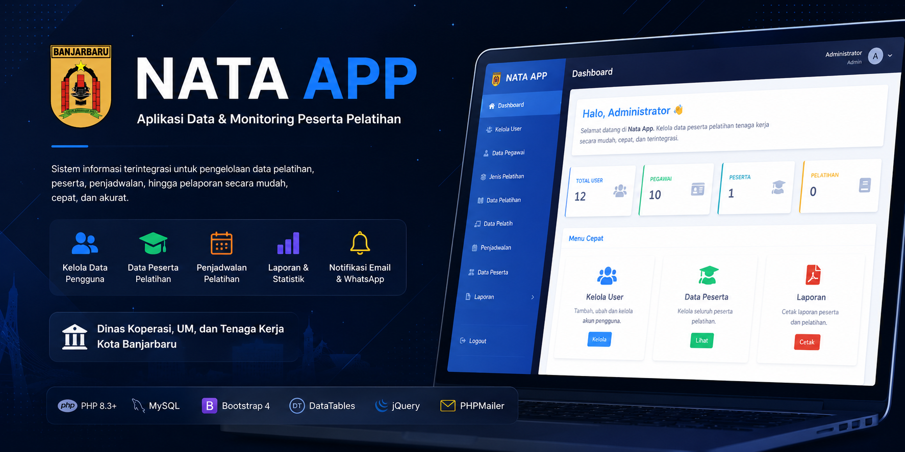
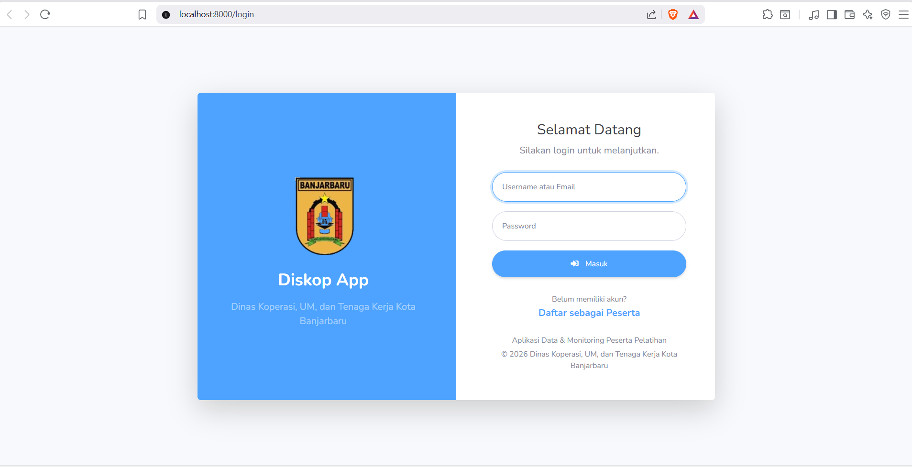
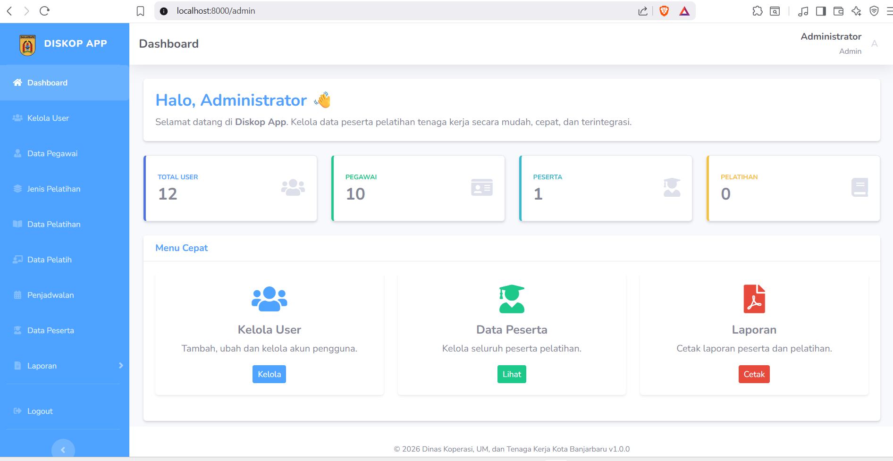

<p align="center">
    
</p>

<p align="center">


</p>

<p align="center">

<strong>Sistem Informasi Data & Monitoring Peserta Pelatihan</strong>

</p>

<p align="center">

Dirancang untuk membantu proses administrasi pelatihan mulai dari
<strong>pendaftaran peserta</strong>,
<strong>penjadwalan</strong>,
<strong>monitoring</strong>,
hingga
<strong>pelaporan</strong>
secara terintegrasi.

</p>

<p align="center">

🌐 <a href="https://natasyadvn.co-id.id">Website Publik</a>
&nbsp;&nbsp;&nbsp;•&nbsp;&nbsp;&nbsp;
📖 Dokumentasi
&nbsp;&nbsp;&nbsp;•&nbsp;&nbsp;&nbsp;
🚧 Versi 1.0.0

</p>

---

# 📖 Tentang Aplikasi

> **Nata App** merupakan sistem informasi berbasis **PHP Native** yang dikembangkan untuk membantu **Dinas Koperasi, Usaha Mikro, dan Tenaga Kerja Kota Banjarbaru** dalam mengelola seluruh proses pelatihan secara digital.

Mulai dari pengelolaan data master, penjadwalan, pendaftaran peserta, proses verifikasi, hingga penyajian laporan dapat dilakukan melalui satu sistem yang terintegrasi.

<p align="center">

✨ **Sederhana** • **Cepat** • **Terintegrasi** • **Mudah Digunakan**

</p>

---

# 🌟 Mengapa Nata App?

<table>
<tr>

<td width="55%" valign="top">

## 🎯 Tujuan Pengembangan

✔️ Digitalisasi proses pelatihan

✔️ Mempermudah administrasi

✔️ Monitoring peserta secara terpusat

✔️ Penyajian laporan lebih cepat

✔️ Mendukung pelayanan publik yang efektif

✔️ Mengurangi proses administrasi manual

</td>

<td width="45%" valign="top">

## 👥 Hak Akses

🛡️ **Administrator**

Mengelola seluruh sistem.

---

👨‍💼 **Pegawai**

Mengelola operasional pelatihan.

---

🎓 **Peserta**

Melakukan pendaftaran dan melihat informasi pelatihan.

</td>

</tr>
</table>

---

# 🚀 Fitur Utama

| Icon | Modul | Deskripsi |
|:---:|--------|-----------|
| 📊 | **Dashboard** | Menampilkan ringkasan statistik berdasarkan hak akses pengguna. |
| 👥 | **Kelola User** | Manajemen akun pengguna dan hak akses. |
| 👨‍💼 | **Data Pegawai** | Pengelolaan data pegawai. |
| 📚 | **Data Pelatihan** | Pengelolaan seluruh data pelatihan. |
| 🗂️ | **Jenis Pelatihan** | Pengelompokan kategori pelatihan. |
| 👨‍🏫 | **Data Pelatih** | Manajemen data instruktur pelatihan. |
| 📅 | **Penjadwalan** | Menentukan jadwal pelaksanaan pelatihan. |
| 🎓 | **Data Peserta** | Pengelolaan peserta pelatihan. |
| 📝 | **Pendaftaran** | Registrasi peserta secara online. |
| 📧 | **Email Notification** | Pengiriman notifikasi Email. |
| 📱 | **WhatsApp Notification** | Pengiriman notifikasi WhatsApp. |
| 📄 | **Laporan** | Penyajian dan pencetakan laporan. |
| ⚙️ | **Pengaturan** | Konfigurasi aplikasi. |

---
## 📷 Screenshot

### 🔐 Login

Halaman autentikasi yang digunakan pengguna untuk masuk ke dalam sistem menggunakan akun yang telah terdaftar.

**Tersedia fitur:**

- Login menggunakan Username atau Email
- Validasi autentikasi pengguna
- Redirect berdasarkan hak akses pengguna
- Antarmuka sederhana dan responsif



---

### 🛡️ Administrator Dashboard

Pusat kontrol utama yang digunakan administrator untuk mengelola seluruh data, aktivitas, dan konfigurasi aplikasi.

#### Modul yang tersedia

| Modul | Deskripsi |
|--------|-----------|
| 📊 Dashboard | Menampilkan ringkasan statistik dan informasi sistem. |
| 👥 Kelola User | Mengelola akun pengguna beserta hak aksesnya. |
| 👨‍💼 Data Pegawai | Mengelola data pegawai yang bertugas pada sistem. |
| 🏷️ Jenis Pelatihan | Mengelompokkan pelatihan berdasarkan kategori. |
| 📚 Data Pelatihan | Mengelola informasi pelatihan, kuota, dan status pelaksanaan. |
| 👨‍🏫 Data Pelatih | Mengelola data instruktur atau narasumber pelatihan. |
| 📅 Penjadwalan | Menyusun jadwal pelatihan beserta waktu pelaksanaannya. |
| 🎓 Data Peserta | Mengelola seluruh data peserta pelatihan. |
| 🔔 Notifikasi | Mengirim pemberitahuan melalui Email dan WhatsApp. |
| 📄 Laporan | Menampilkan serta mencetak laporan pelatihan dan peserta. |



---

# 📌 Informasi Proyek

<table>

<tr>
<td width="200"><b>🏷️ Nama Aplikasi</b></td>
<td>Nata App</td>
</tr>

<tr>
<td><b>🌐 Platform</b></td>
<td>Web Application</td>
</tr>

<tr>
<td><b>💻 Bahasa</b></td>
<td>PHP Native</td>
</tr>

<tr>
<td><b>🗄️ Database</b></td>
<td>MySQL / MariaDB</td>
</tr>

<tr>
<td><b>🏛️ Arsitektur</b></td>
<td>MVC (Model - View - Controller)</td>
</tr>

<tr>
<td><b>👥 Pengguna</b></td>
<td>Administrator • Pegawai • Peserta</td>
</tr>

<tr>
<td><b>🚧 Status</b></td>
<td>Dalam Pengembangan</td>
</tr>

<tr>
<td><b>🌐 Website</b></td>
<td>

https://natasyadvn.co-id.id

</td>
</tr>

</table>

---

# 👩‍💻 Pengembang

<p align="center">


</p>

<h3 align="center">

Natasya Deviana

</h3>

<p align="center">

Pengembang aplikasi <b>Nata App</b> yang berfokus pada pengembangan aplikasi web berbasis <b>PHP Native</b> menggunakan arsitektur <b>MVC</b> yang ringan, sederhana, dan mudah dikembangkan.

</p>

<p align="center">

🌐 https://natasyadvn.co-id.id

</p>

---

<p align="center">


</p>

<p align="center">

<b>Nata App</b>

<br>

© 2026 Natasya Deviana

</p>

---

# 🛠️ Teknologi yang Digunakan

Nata App dikembangkan menggunakan teknologi yang ringan, stabil, dan mudah dipelajari sehingga cocok untuk pengembangan maupun kebutuhan pembelajaran.

<table>
<tr>

<td width="50%" valign="top">

### 💻 Backend

- PHP 8.3+
- Composer
- PHPMailer
- Monolog
- Dotenv

</td>

<td width="50%" valign="top">

### 🎨 Frontend

- Bootstrap 4
- jQuery
- DataTables
- Font Awesome

</td>

</tr>
</table>

### 🗄️ Database

- MySQL
- MariaDB

---

# 📦 Struktur Proyek

Struktur direktori Nata App disusun menggunakan pola **MVC (Model - View - Controller)** sehingga kode lebih mudah dipelajari, dipelihara, dan dikembangkan.

```text
📦 Nata App
│
├── 📂 app
│   ├── 📂 App
│   ├── 📂 Controllers
│   ├── 📂 Middleware
│   ├── 📂 Models
│   ├── 📂 Services
│   ├── 📂 Helpers
│   └── 📂 Views
│
├── 📂 bootstrap
│
├── 📂 config
│
├── 📂 database
│
├── 📂 public
│   ├── 📂 assets
│   ├── 📂 uploads
│   └── index.php
│
├── 📂 routes
│
├── 📂 storage
│   ├── 📂 logs
│   ├── 📂 cache
│   └── 📂 uploads
│
├── 📂 vendor
│
├── composer.json
└── .env
```

---

## 📂 Penjelasan Direktori

| Direktori | Fungsi |
|-----------|---------|
| 📂 **app** | Berisi seluruh source code aplikasi. |
| 📂 **bootstrap** | Inisialisasi dan proses boot aplikasi. |
| 📂 **config** | Konfigurasi sistem dan layanan. |
| 📂 **database** | Database, migrasi, seeder, dan file SQL. |
| 📂 **public** | Public directory yang diakses melalui web server. |
| 📂 **routes** | Seluruh routing aplikasi. |
| 📂 **storage** | Penyimpanan log, cache, dan file upload. |
| 📂 **vendor** | Seluruh dependency Composer. |

---

<p align="center">

✨ Struktur proyek dibuat sederhana agar mudah dipahami oleh mahasiswa maupun pengembang yang ingin mempelajari arsitektur aplikasi berbasis PHP Native.

</p>

---

---

# 🚀 Instalasi

Ikuti langkah-langkah berikut untuk menjalankan **Nata App** pada komputer lokal.

<table>

<tr>
<td width="60">

### 1️⃣

</td>
<td>

**Clone Repository**

```bash
git clone https://github.com/USERNAME/nata-app.git
```

</td>
</tr>

<tr>
<td>

### 2️⃣

</td>
<td>

**Masuk ke Direktori Project**

```bash
cd nata-app
```

</td>
</tr>

<tr>
<td>

### 3️⃣

</td>
<td>

**Install Seluruh Dependency**

```bash
composer install
```

</td>
</tr>

<tr>
<td>

### 4️⃣

</td>
<td>

**Salin File Environment**

```bash
cp .env.example .env
```

</td>
</tr>

<tr>
<td>

### 5️⃣

</td>
<td>

**Import Database**

```text
database/database.sql
```

</td>
</tr>

<tr>
<td>

### 6️⃣

</td>
<td>

**Jalankan Web Server**

```bash
php -S localhost:8000 -t public
```

</td>
</tr>

</table>

---

## 🌐 Akses Aplikasi

Setelah web server berhasil dijalankan, buka browser dan akses alamat berikut.

```text
http://localhost:8000
```

---

# ⚙️ Konfigurasi

Seluruh konfigurasi aplikasi tersusun secara terpisah agar mudah dikelola.

| 📂 Lokasi | Keterangan |
|:----------|:-----------|
| `config/` | Konfigurasi aplikasi |
| `.env` | Konfigurasi environment |
| `storage/logs/` | Penyimpanan log aplikasi |
| `storage/cache/` | Cache aplikasi |
| `public/uploads/` | File upload pengguna |

> 💡 **Tips**
>
> Setelah melakukan perubahan pada file **`.env`** atau konfigurasi aplikasi, restart web server agar perubahan dapat diterapkan.

---

# 📬 Sistem Notifikasi

Nata App menyediakan fitur notifikasi untuk mempermudah penyampaian informasi kepada pengguna.

<table>

<tr>

<td width="50%">

### 📧 Email

- SMTP
- PHPMailer
- HTML Email
- Template Email

</td>

<td width="50%">

### 📱 WhatsApp

- Fonnte API
- Notifikasi Otomatis
- Broadcast
- Reminder

</td>

</tr>

</table>

---

# 🏛️ Arsitektur

Nata App dikembangkan menggunakan pola **MVC (Model - View - Controller)** dengan pemisahan tanggung jawab pada setiap lapisan aplikasi.

```text
        Browser
            │
            ▼
        Router
            │
            ▼
      Controller
            │
            ▼
        Service
            │
            ▼
       Repository
            │
            ▼
        Database
```

---

## 🧩 Komponen Inti

<table>

<tr>

<td width="50%">

### Core

- 🌐 Router
- 🧱 Controller
- 🎨 View
- 🗂️ Model
- 🛡️ Middleware
- 🔐 Authentication

</td>

<td width="50%">

### Services

- ⚙️ Configuration
- 📦 Session
- 📧 Mail
- 📱 Notification
- 📝 Logger
- ⏰ Scheduler

</td>

</tr>

</table>

---

<p align="center">

### 💙 Terima kasih telah menggunakan Nata App

Semoga aplikasi ini dapat membantu proses digitalisasi administrasi pelatihan menjadi lebih mudah, cepat, dan efisien.

⭐ Jangan lupa memberikan **Star** apabila repository ini bermanfaat.

</p>

---

## 📜 Lisensi

Nata App dikembangkan untuk kebutuhan pembelajaran, penelitian, serta pengembangan sistem informasi pada **Dinas Koperasi, Usaha Mikro, dan Tenaga Kerja Kota Banjarbaru**.

Hak cipta tetap dimiliki oleh pengembang. Seluruh kode sumber dapat digunakan sebagai referensi pembelajaran dengan tetap mencantumkan atribusi kepada pengembang apabila diperlukan.
